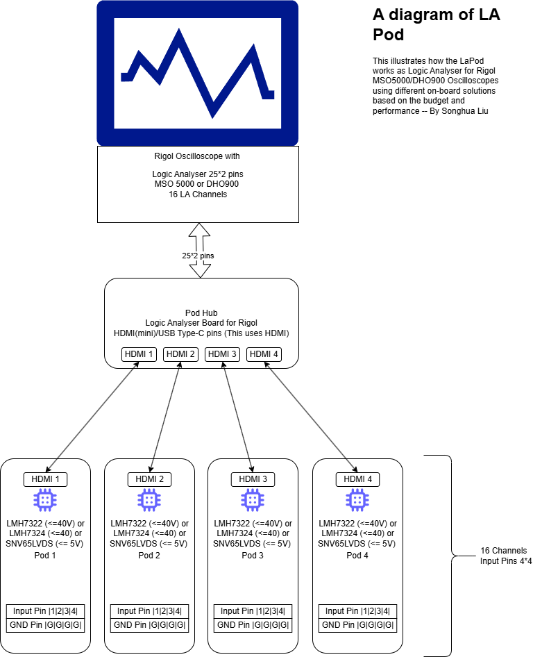

# A-diagram-of-LA-Pod
This illustrates how the LaPod works as Logic Analyser for Rigol MSO5000/DHO900 Oscilloscopes using different on-board solutions based on the budget and performance. 

Draw by Songhua Liu

Read the blog here: <https://www.cnblogs.com/spaceship9/p/18234908>
